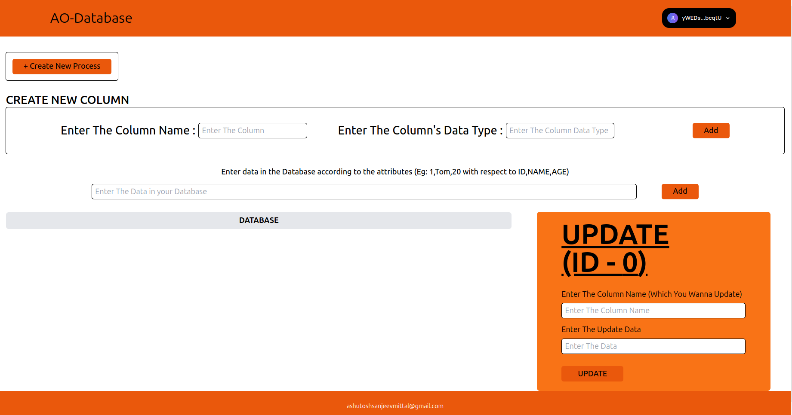

# <h1 align="center">AO-DATABASE</h1>

<p align="center">
  
</p>
<p align="center">
  
</p>

<p align="center">Welcome to AO DATABASE, your platform for effortlessly creating and managing databases through an intuitive graphical interface, enabling seamless functions such as updates and deletions etc.</p>

# Index

- [AO-DATABASE](#ao-database)
- [Index](#index)
- [Introduction](#introduction)
  - [Techstack](#techstack)
  - [Features](#features)
- [How to setup](#how-to-setup)
  - [Clone the repo](#clone-the-repo)
  - [Install dependencies](#install-dependencies)
  - [ArConnect Wallet](#arConnect-wallet)
- [Finally run the webapp](#finally-run-the-webapp)
- [License](#license)

# Introduction

AO DATABASE! Built upon the powerful AO and lsqlite3 technologies, this user-friendly GUI platform empowers users to effortlessly create databases, add data, and execute standard database operations with ease.

## Techstack
     
    - Vite + ReactJS with Javascript
    - TailwindCSS
    - LUA (lsqlite3)
    - AO Connect
    - Arweave-wallet-kit

## ✨ Features

- **User-Friendly GUI**: A simple and intuitive graphical user interface built using AO and LUA lsqlite3.
- **Database Creation**: Easily create your own databases with customizable column names (attributes).
- **Generate Process IDs**: Generate or create new process IDs 
- **Data Insertion**: Seamlessly add new data to your database. 
- **Data Deletion**: Effortlessly delete unwanted data.
- **Data Updating**: Quickly update existing data in your database.
- **Dynamic Column Handling**: Add new columns to existing databases, with new column data defaulting to NULL for easy updates.
- **Flexibility**: Manage and manipulate your database with ease, ensuring efficient data organization and retrieval.
# How to setup
## Clone the repo

Fork and clone the repo

```bash
git clone git@github.com:AAshu1412/ao-database.git
cd ao-database
```

## Install dependencies

```bash
npm install
```
## ArConnect Wallet
If you don't have ArConnect Wallet then [click here](https://www.arconnect.io/download) to download the wallet on your browser.

After downloading the wallet setup your wallet to use the AO_DATABASE

# Finally run the webapp

```bash
cd ..
npm start
```

The webapp will be running on `localhost:5173`

To open the same application of another device for testing purposes, make sure that the device is connected to the same network as the device on which the webapp is running. Then visit `http://<IP_ADDRESS_OF_THE_DEVICE_RUNNING_THE_WEBAPP>:5173`

# License

The projects is licensed under [MIT](https://choosealicense.com/licenses/mit/)
